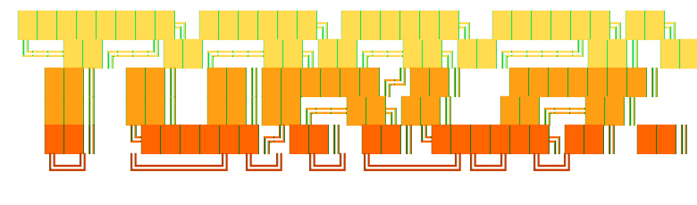

<div align="center">



### 🔥 *the self-healing AI scraping agent*

**point torch at a URL → it writes a scraper → it writes the playbook → it ships the playbook.**
**when the site changes and the playbook breaks → torch redoes recon → updates the playbook → ships again.**

[](./LICENSE)
[](https://nodejs.org)
[](./skills/sites)
[](https://github.com/badlogic/pi-mono)
[](#)

**point it at any website. it does the rest.**

```bash
torch https://news.ycombinator.com
```

*→ recon, framework detection, anti-bot escalation, extraction, and a reusable `skills/sites/hackernews/SKILL.md` playbook — written by torch, for torch*

</div>

---

## 🎯 what torch actually does

you give it a URL. torch does all of the following, autonomously, while you get coffee:

```
  URL ─┐
       ▼
  ┌─────────────────────────────────────────┐
  │  🕵️  recon       curl it, detect framework (next.js / shopify / spa / etc)
  │  🧩  strategy    pick lightest approach: api → sitemap → cheerio → browser
  │  🛡️  evasion     real Chrome profile → stealth → solver → proxy (escalating)
  │  ⚗️  extract     write scraper, run as background process, validate output
  │  📚  playbook    save what worked to skills/sites/<slug>/SKILL.md forever
  │  🔁  propagate   prompt user to PR the skill back upstream
  └─────────────────────────────────────────┘
       ▼
  ./output/<slug>.json + ./skills/sites/<slug>/SKILL.md
```

the killer move is the **playbook persistence**. every site torch figures out becomes a reusable skill that future runs read first, skipping recon entirely. the 29 skills that ship with this repo were all generated by torch itself driving itself via RPC mode against a real Chrome profile.

---

## ⚡ quick start

```bash
git clone https://github.com/AgentComputerAI/torch
cd torch
npm install
npm run build
npm install -g .
```

```bash
# interactive session — chat with torch about what to scrape
torch

# one-shot — point and shoot
torch https://www.digikey.com/en/products/category/microcontrollers/685

# one-shot with a target description
torch https://www.amazon.com/s?k=mechanical+keyboard "top 30 keyboards with price, rating, reviews"

# JSONL RPC mode — drive torch from any language over stdin/stdout
torch --rpc
```

torch will auto-clone your Chrome profile on first run (one-time, ~10-30s via rsync with cache exclusion, ~200MB on disk), auto-launch Chrome with `--remote-debugging-port=9222`, and every subsequent run reuses the same Chrome instance instantly.

---

## 🧠 the core trick: real Chrome > stealth patches

every other scraper fights the same losing battle: launch a fresh Chromium, patch `navigator.webdriver`, rotate a fake fingerprint, and lose anyway because the site's bot scorer weighs **reputation** and **browsing history** more than any single fingerprint signal.

torch flips it. on first run it **clones your actual Chrome profile** (excluding caches via rsync) into `~/.torch/chrome-profile`, then auto-launches a second Chrome instance against that clone with the debug port open. when the scrape skill needs a browser, it does:

```js
import puppeteer from "puppeteer-core";
const browser = await puppeteer.connect({
  browserURL: process.env.TORCH_CHROME_ENDPOINT, // http://127.0.0.1:9222
});
```

that browser has **your** cookies, **your** history, **your** TLS session state, **your** Client Hints. Amazon, Walmart, Target, eBay, Zillow, Booking, Airbnb, Costco — all landed on first try with this approach. no stealth patches. no solvers. no proxies.

## 🖥️ running on a VM / headless server

the real-Chrome-clone trick obviously can't work if there's no host Chrome to clone — VMs, CI boxes, remote scraping pods, Docker containers, anything without a logged-in user profile. on those machines torch falls back through two cheaper tiers:

1. **Camoufox** (if `TORCH_CAMOUFOX_ENDPOINT` is set) — a Firefox fork with fingerprint spoofing patched into the engine at the **C++ level**. unlike puppeteer-stealth's JS shims, Camoufox's patches are invisible to JavaScript, so anti-bot systems can't detect the tampering itself. includes a built-in virtual display so it runs headfully on headless servers without xvfb. see the [`camoufox`](./skills/camoufox/SKILL.md) skill for the full integration playbook.

   ```bash
   # on your VM / CI base image, install once:
   pip install camoufox[geoip] && python -m camoufox fetch
   npm install playwright-core

   # launch as a Playwright server torch connects to
   python -m camoufox server --port 4444 &
   echo "TORCH_CAMOUFOX_ENDPOINT=ws://127.0.0.1:4444" >> .env
   ```

2. **Disposable Chromium + puppeteer-extra-stealth** (no env var set, last-resort fallback) — bundled with torch by default, works for soft targets, gets blocked on anything with serious bot scoring. this is where the 9-layer anti-blocking ladder exists to fight its way through.

on your own laptop, real-Chrome-clone is the right answer and torch defaults to it. on a VM, install Camoufox and torch will transparently route browser scrapes through it instead.

---

## 🔧 skills

torch is built on [pi-coding-agent](https://github.com/badlogic/pi-mono)'s skill system. every capability is a `SKILL.md` the agent routes to on demand.

### core skills

| skill | what it does |
|---|---|
| 🕷️ **`scrape`** | the full scraping workflow — recon, strategy, extraction, anti-blocking, playbook authoring |
| 🦊 **`camoufox`** | Firefox fork with C++-level fingerprint spoofing — use on VMs / CI where real-Chrome-clone can't run |
| 🤖 **`2captcha`** | solve reCAPTCHA v2/v3, Turnstile, hCaptcha via the 2Captcha API (human workers, ~$1/1k) |
| 🧠 **`capmonster`** | cheaper AI-based solver with `cf_clearance` support (~$0.60/1k) |
| 🌐 **`proxy`** | authenticated residential proxy integration — Oxylabs, Bright Data, Smartproxy, IPRoyal |
| 📬 **`agentmail`** | disposable email inboxes for gated signup flows |
| 🤝 **`contributing`** | PR workflow + quality bar for sharing new site skills upstream |

### site skills — 29 shipped by default

all generated by torch itself via RPC mode against a real Chrome profile. each documents detection signals, the strategy that worked, copy-pasteable stealth config, selectors/endpoints, an anti-blocking table, real data shape, pagination, and gotchas.

| category | sites |
|---|---|
| 📡 **public API** (skip browser) | `arxiv` · `github` · `hackernews` · `huggingface` · `pypi` · `reddit` · `stackoverflow` · `wikipedia` |
| 📄 **SSR / embedded JSON** | `apple` · `doordash` · `ikea` · `imdb` · `nike` · `producthunt` |
| 🛒 **e-commerce** (real Chrome) | `amazon` · `costco` · `ebay` · `etsy` · `homedepot` · `target` · `walmart` |
| 🧳 **marketplace / travel** | `airbnb` · `booking` · `ubereats` |
| 🏠 **real estate / local** | `redfin` · `yelp` · `zillow` |
| 🛡️ **hardened** (PerimeterX / DataDome / Akamai) | `digikey` · `stockx` |

### adding a new site skill

just run torch on it:

```bash
torch https://www.whatever.com
```

torch does Phase 0 recon → Phase 1 framework detection → Phase 2 browser scraping if needed → writes `./output/<slug>.json` → writes `./skills/sites/<slug>/SKILL.md` → tells you to open a PR. if you do, the next torch user inherits your playbook automatically. **self-propagating knowledge base.**

---

## 🛡️ anti-blocking ladder

torch escalates through these layers only as far as needed. stops at the first one that works.

```
  Layer 0  🏆  connect to real Chrome (TORCH_CHROME_ENDPOINT)
  Layer 1  👻  headed mode + puppeteer-extra-plugin-stealth (fallback)
  Layer 2  📋  realistic headers + randomized viewport + UA rotation
  Layer 3  🍪  cookie / session persistence across runs
  Layer 4  🐁  behavioral mimicry (delays, scroll, mouse jitter)
  Layer 5  ☁️   Cloudflare challenge handling + Turnstile detection
  Layer 6  🤖  2captcha or capmonster solver invocation
  Layer 7  🌐  residential proxy rotation via proxy
  Layer 8  ⚡  resource blocking (images/css/fonts) for speed
  Layer 9  👨‍💻  interactive fallback — opens site in your browser for manual click-through
```

Layer 0 solves 27 of the 29 sites in this repo on its own.

---

## 🔌 RPC mode

drive torch from any language. stream JSONL commands on stdin, get JSONL events on stdout.

```bash
(echo '{"type":"prompt","message":"scrape https://news.ycombinator.com"}'; sleep 300) | torch --rpc
```

see [pi-mono RPC docs](https://github.com/badlogic/pi-mono/blob/main/packages/coding-agent/docs/rpc.md) for the full protocol. commands: `prompt`, `steer`, `follow_up`, `abort`, `new_session`, `get_state`, `get_messages`, `set_model`, `cycle_model`, `set_thinking_level`.

this is how the 29 site skills in this repo were generated — a small Node driver that spawns `torch --rpc`, sends one prompt per site, waits for `agent_end`, and moves on. 10 instances in parallel.

---

## 📦 prerequisites

| required | optional |
|---|---|
| **Node.js ≥ 20** | **AgentMail API key** — only for `agentmail` (gated signups) |
| **Google Chrome** (for real-profile scraping) | **2Captcha / CapMonster key** — only when a target hits a captcha |
| **Anthropic / OpenAI API key** (for the agent brain) | **Residential proxy creds** — only when IP-banned |

the real Chrome auto-clone is optional but **strongly recommended** — it's the difference between landing on Amazon instantly and burning an hour fighting bot scores.

---

## 🏗️ architecture

```
  torch <url>
     │
     ├─ cli.ts                     parse args, load .env
     │    │
     │    ├─ ensureChromeEndpoint()   detect / clone / launch Chrome debug port
     │    │
     │    └─ spawn pi-coding-agent with:
     │         ├─ SYSTEM.md          invariants, scout mode, naming, cleanup
     │         ├─ skills/
     │         │   ├─ scrape/        reconnaissance + extraction workflow
     │         │   ├─ 2captcha/      solver API
     │         │   ├─ capmonster/    solver API
     │         │   ├─ proxy/         residential proxy patterns
     │         │   ├─ agentmail/     disposable inboxes
     │         │   ├─ contributing/  PR workflow
     │         │   └─ sites/<slug>/  per-site playbooks (29 shipped)
     │         ├─ extensions/
     │         │   └─ header.ts      fire-themed terminal banner
     │         └─ pi-processes       background scrape process management
     │
     └─ output/<slug>.json + skills/sites/<slug>/SKILL.md
```

---

## 🧪 development

```bash
npm run dev           # run via tsx, no build step
npm run build         # compile src/ → dist/
npm start             # run compiled entry
```

---

## 📜 license

MIT. see [LICENSE](./LICENSE). built on [pi-coding-agent](https://github.com/badlogic/pi-mono) by Mario Zechner.

<div align="center">

### 🔥 *self-healing. self-propagating. self-improving.* 🔥

**every site anyone figures out becomes a skill the whole community inherits.**
**every broken playbook auto-repairs itself on the next run.**

*contribute back at [github.com/AgentComputerAI/torch](https://github.com/AgentComputerAI/torch)*

</div>
